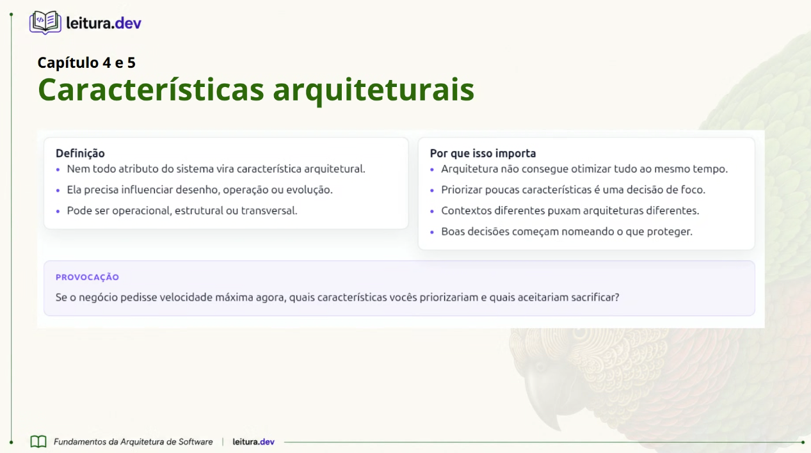

# 📚 Capítulo 4: Definições das características arquiteturais

No Capítulo 4 os autores explicam o que são as características de arquitetura e por que elas são tão importantes para um sistema funcionar bem. Antes, elas eram conhecidas como **requisitos não funcionais**, mas o livro prefere usar o termo "características de arquitetura", pois ele deixa mais claro o papel de cada uma.

De forma simples, os requisitos de negócio dizem **o que o sistema deve fazer**, enquanto as características de arquitetura mostram **como ele deve funcionar**. Elas definem, por exemplo, se o sistema será rápido, seguro, fácil de manter e capaz de atender muitos usuários ao mesmo tempo.

Os principais pontos do capítulo são:

**1. O que faz um requisito ser uma característica de arquitetura**

Para ser considerada uma característica de arquitetura, ela precisa atender a três pontos:

* Não pode ser uma funcionalidade do sistema, mas sim uma qualidade ou comportamento esperado.
* Deve influenciar a forma como o sistema será desenvolvido e organizado.
* Precisa ser importante para que o projeto tenha sucesso.

**2. Os tipos de características de arquitetura**

O livro divide essas características em alguns grupos:

* **Operacionais:** -> são as que estão relacionadas ao funcionamento do sistema. Alguns exemplos são a disponibilidade (o sistema ficar no ar) e a performance (responder rapidamente).
* **Estruturais:** -> têm relação com a organização do código. Exemplos são a facilidade para adicionar novas funcionalidades e para fazer manutenção.
* **Transversais:** -> são características que afetam todo o sistema, como segurança e acessibilidade.
* **Nuvem:** -> são voltadas para sistemas que usam serviços em nuvem, como a capacidade de aumentar os recursos automaticamente quando o número de acessos cresce.

**3. A importância de encontrar um equilíbrio**

Um dos pontos mais interessantes do capítulo é que nem sempre é possível ter todas as características no melhor nível. Por exemplo, um sistema muito seguro pode ficar mais lento, e um sistema muito fácil de modificar pode custar mais para ser desenvolvido.

Por isso, o objetivo não é criar uma arquitetura perfeita, mas sim encontrar a melhor solução possível para cada situação. Os autores chamam isso de **"arquitetura menos pior"**, ou seja, fazer escolhas e equilibrar os pontos positivos e negativos de acordo com as necessidades do projeto, o tempo disponível e o orçamento.

## Discusão do livro:

