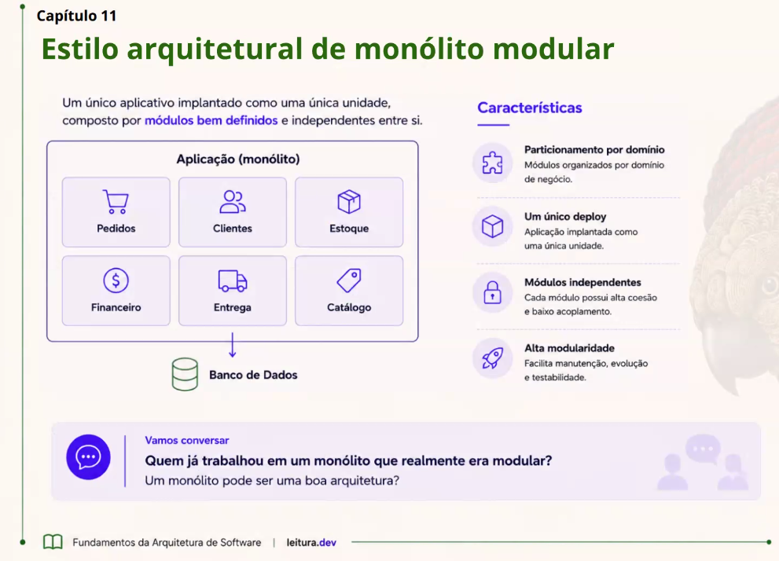

# Capítulo 11 – Estilo Arquitetural de Monólito Modular

O **Monólito Modular** é uma evolução do monólito tradicional. Ele ganhou bastante popularidade com o uso do **DDD (Domain-Driven Design)**, pois organiza o sistema por **áreas de negócio** em vez de separar apenas por funções técnicas.

Mesmo sendo dividido em módulos, ele continua sendo **uma única aplicação** na hora de executar e fazer o deploy.

> 💡 **Importante:** Um **Monólito Modular não é um Microserviço**. Os módulos são separados apenas na organização do código, mas todos continuam rodando dentro da mesma aplicação. Se a aplicação parar, todos os módulos param juntos.

---

# 1. O que é um Monólito Modular?

Em vez de separar o sistema por partes técnicas, como:

- Banco de Dados
- Interface
- Regras de Negócio

ele é separado por aquilo que o sistema faz.

Por exemplo, em um sistema de loja:

- 📦 Pedidos
- 💳 Pagamentos
- 📦 Estoque
- 👤 Clientes

Cada módulo possui suas próprias regras, componentes, serviços e acesso aos dados.

> A ideia é que cada módulo cuide apenas da sua responsabilidade.

Mesmo com essa divisão, tudo roda como **uma única aplicação**.

---

# 2. Como ele é organizado?

Existem duas formas principais.

## 📁 Estrutura Monolítica

Todo o código fica dentro de **um único projeto React**.

Exemplo:

```text
src/
├── modules/
│   ├── auth/
│   ├── products/
│   ├── orders/
│   └── users/
├── App.jsx
└── main.jsx
```

Cada módulo possui seus próprios:

- Components
- Hooks
- Pages
- Services

> **Observação:** Apesar da separação por pastas, todos os módulos são compilados e publicados juntos como **uma única aplicação**.

### Vantagens

- Fácil de desenvolver.
- Fácil de testar.
- Deploy simples.
- Organização por domínio de negócio.

### Desvantagens

- Exige disciplina da equipe.
- Um módulo pode acabar acessando outro diretamente se não houver regras.

---

## 🧩 Estrutura Modular

Cada módulo é organizado de forma independente dentro da aplicação.

Exemplo:

```text
src/
├── modules/
│
├── auth/
│   ├── components/
│   ├── hooks/
│   ├── pages/
│   ├── services/
│   └── index.js
│
├── products/
│   ├── components/
│   ├── hooks/
│   ├── pages/
│   ├── services/
│   └── index.js
│
└── orders/
    ├── components/
    ├── hooks/
    ├── pages/
    ├── services/
    └── index.js
```

Cada módulo possui sua própria estrutura e responsabilidade.

> **Observação:** Em React normalmente organizamos os módulos por pastas. Em linguagens como Java ou C#, esses módulos podem ser separados em bibliotecas (JARs ou DLLs) antes de formar a aplicação final.

### Vantagens

- Melhor separação entre módulos.
- Equipes diferentes podem trabalhar em módulos diferentes.
- Menor risco de misturar responsabilidades.
- Código mais organizado.

### Desvantagens

- Organização um pouco mais complexa.
- Continua sendo uma única aplicação.

---

# 3. Como os módulos conversam?

Os módulos precisam trocar informações.

Existem duas formas principais.

## 🔗 Comunicação Direta (Peer-to-Peer)

Um módulo chama outro diretamente.

Fluxo:

```text
Orders
   │
   ▼
Payments
```

Exemplo:

```javascript
// modules/orders/services/createOrder.js

import { processPayment } from "../../payments/services/processPayment";

export async function createOrder(order) {
  await processPayment(order.total);
}
```

Nesse caso, o módulo **Orders** conhece diretamente o módulo **Payments**.

### Vantagens

- Fácil de implementar.
- Comunicação rápida.
- Menos código.

### Desvantagens

- Aumenta o acoplamento.
- Mudanças em um módulo podem afetar outros.

---

## 🎯 Comunicação por Mediador

Em vez de um módulo conversar diretamente com outro, existe um intermediador.

Fluxo:

```text
Orders
   │
   ▼
Payment Gateway
   │
   ▼
Payments
```

Exemplo:

```javascript
// services/paymentGateway.js

export async function pay(total) {
  // Decide qual serviço de pagamento utilizar
}
```

```javascript
// modules/orders/services/createOrder.js

import { pay } from "../../services/paymentGateway";

export async function createOrder(order) {
  await pay(order.total);
}
```

Agora o módulo **Orders** não conhece diretamente o módulo **Payments**.

Se amanhã o sistema trocar de Stripe para Mercado Pago, por exemplo, basta alterar apenas o `paymentGateway.js`.

### Vantagens

- Menor acoplamento.
- Melhor organização.
- Mais fácil trocar implementações.
- Facilita manutenção.

### Desvantagens

- Um pouco mais complexo.
- Adiciona uma camada intermediária.

---

# 4. Exemplo Prático

Imagine um sistema de **e-commerce**.

A aplicação pode estar organizada assim:

```text
src/
└── modules/
    ├── auth/
    ├── products/
    ├── cart/
    ├── checkout/
    └── orders/
```

Se for necessário alterar apenas a lógica do carrinho de compras, basta modificar o módulo **cart**.

Os módulos **products**, **orders**, **auth** e **checkout** continuam funcionando normalmente.

Essa organização facilita:

- Encontrar bugs.
- Criar novas funcionalidades.
- Trabalhar em equipe.
- Manter o código organizado.

---

# Características do Monólito Modular

| Característica | Avaliação | Observação |
|----------------|-----------|------------|
| 💰 Custo Geral | ⭐ | Baixo custo para desenvolver e manter. |
| 😊 Simplicidade | ⭐⭐⭐⭐⭐ | Muito fácil de entender e desenvolver. |
| 🧩 Modularidade | ⭐⭐⭐ | Boa separação dos módulos, mas continua sendo uma única aplicação. |
| 📈 Escalabilidade | ⭐ | Para aumentar a capacidade, é preciso escalar toda a aplicação. |
| 🧪 Testabilidade | ⭐⭐ | Melhor que um monólito tradicional, mas muitos testes ainda envolvem a aplicação inteira. |
| 🚀 Facilidade de Deploy | ⭐⭐ | Qualquer alteração exige publicar toda a aplicação novamente. |
| 🛡️ Tolerância a Falhas | ⭐ | Se a aplicação parar, todos os módulos param juntos. |

---

# Vantagens

- Fácil de desenvolver.
- Organização por domínio de negócio.
- Código mais limpo e organizado.
- Mais simples que uma arquitetura de microserviços.
- Menor custo de desenvolvimento.
- Facilita manutenção e evolução do sistema.

---

# Desvantagens

- Continua sendo uma única aplicação.
- Não escala tão bem quanto microserviços.
- Um erro grave pode afetar todo o sistema.
- O deploy sempre acontece na aplicação inteira.

---

# Quando Utilizar?

✅ Sistemas pequenos e médios.

✅ Equipes organizadas por domínio de negócio.

✅ Projetos que precisam de organização sem a complexidade dos microserviços.

✅ Empresas que desejam evoluir um monólito tradicional.

---

# Quando Evitar?

❌ Sistemas com milhões de usuários.

❌ Aplicações que precisam escalar apenas partes específicas.

❌ Sistemas distribuídos.

❌ Projetos que exigem alta disponibilidade.

---

# Resumo

O **Monólito Modular** mantém a simplicidade de um monólito tradicional, mas organiza o código em **módulos separados por domínio de negócio**.

Cada módulo possui sua própria responsabilidade, tornando o sistema mais organizado, fácil de entender e de manter.

Apesar dessa organização, todos os módulos continuam fazendo parte da mesma aplicação, sendo compilados, executados e publicados juntos.

É uma excelente escolha para equipes que desejam um código organizado e de fácil manutenção, sem assumir toda a complexidade de uma arquitetura baseada em microserviços. Entretanto, quando o sistema precisa crescer muito ou escalar partes específicas da aplicação, essa arquitetura pode deixar de ser a melhor opção.

# Leitura com clube

<div align="start">
  
</div>
