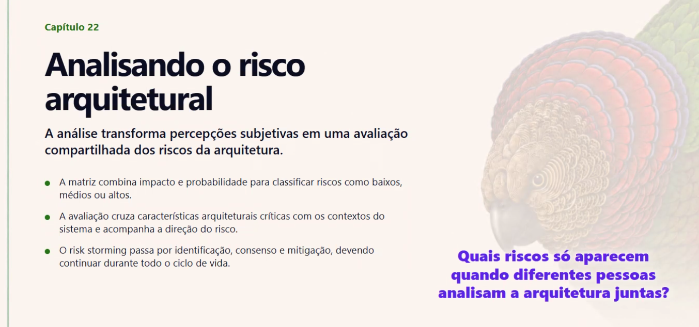

# Capítulo 22 — Analisando Riscos de Arquitetura

O **Capítulo 22 — Analisando Riscos de Arquitetura** (*Analyzing Architecture Risk*) fala sobre como **identificar, medir e reduzir riscos arquiteturais** antes que eles causem problemas em produção.

A ideia principal é que o arquiteto não deve apenas imaginar onde o sistema pode falhar, mas **avaliar os riscos continuamente e tomar medidas para reduzi-los**.

---

## 1. Matriz de Risco (*Risk Matrix*)

O risco é calculado considerando duas dimensões:

* **Impacto:** o quão grave seria a falha.
* **Probabilidade:** qual a chance de ela acontecer.

```text
Risco = Impacto × Probabilidade
```

A classificação pode ser:

* **1–2:** Risco baixo
* **3–4:** Risco médio
* **6–9:** Risco alto

Quanto maior o risco, maior a necessidade de atenção e possíveis mudanças na arquitetura.

---

## 2. Avaliação de Riscos (*Risk Assessment*)

A equipe pode analisar diferentes partes do sistema considerando características como:

* Segurança
* Performance
* Escalabilidade
* Disponibilidade

Também é possível acompanhar se o risco está:

* `🔽` Diminuindo
* `🔼` Aumentando

Ferramentas como **Fitness Functions** podem ajudar a monitorar essas características automaticamente.

---

## 3. Risk Storming

O **Risk Storming** é uma atividade colaborativa para identificar riscos diretamente no diagrama da arquitetura.

Possui três etapas:

1. **Identificação**

   * Cada participante identifica riscos individualmente.

2. **Consenso**

   * A equipe compara as percepções e discute as divergências.

3. **Mitigação**

   * A equipe busca maneiras de eliminar ou reduzir os riscos encontrados.

Exemplos de mitigação:

* Adicionar cache.
* Isolar componentes.
* Utilizar filas e retentativas.
* Melhorar o tratamento de erros.

---

## 4. Exemplo em React

Imagine um campo de busca que chama a API a cada tecla digitada.

```text
Usuário digita
      ↓
API é chamada
      ↓
API é chamada
      ↓
API é chamada
      ↓
Muitas requisições
```

Isso pode representar um risco de **performance**.

Uma possível mitigação seria utilizar **Debounce**, aguardando o usuário parar de digitar antes de realizar a requisição.

Outro exemplo seria um componente secundário com erro derrubar toda a página. Nesse caso, um **Error Boundary** pode ajudar a isolar o erro.

---

## Resumo

O processo de análise de riscos pode ser resumido em:

```text
Identificar
    ↓
Medir
    ↓
Priorizar
    ↓
Mitigar
    ↓
Monitorar
```

A principal ideia do capítulo é:

> **Riscos arquiteturais devem ser identificados e tratados continuamente, e não somente depois que causam problemas em produção.**

O objetivo não é eliminar todos os riscos, mas **entender quais são importantes e tomar decisões conscientes para reduzi-los**.

---

# Leitura


