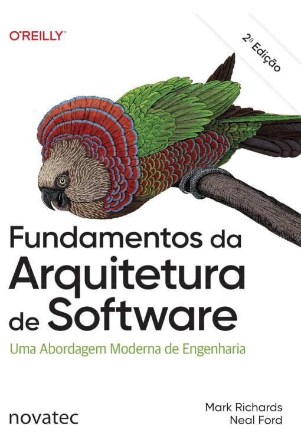

# 📚 Estudo: Fundamentos da Arquitetura de Software

Este repositório é dedicado ao estudo e documentação do livro **"Fundamentos da Arquitetura de Software: Uma Abordagem de Engenharia"** (Fundamentals of Software Architecture), escrito por Mark Richards e Neal Ford.

O objetivo é registrar o que estou aprendendo sobre arquitetura de software, organizando os principais conceitos, ideias e reflexões do livro de forma simples e prática.

---

## 📂 Organização do repositório

O conteúdo será organizado por capítulos do livro:

- `Capitulo-01/`
- `Capitulo-02/`
- `Capitulo-03/`

Cada pasta vai conter:
- resumos do capítulo
- pontos principais
- anotações pessoais
- (quando fizer sentido) diagramas ou exemplos simples

---

## 🗺️ O que o livro aborda

O livro trata dos principais fundamentos da arquitetura de software, como:

- **Pilares da Arquitetura**
  Características arquiteturais (como escalabilidade, performance e disponibilidade), decisões de arquitetura e princípios de design.

- **Estilos Arquiteturais**
  Comparação entre diferentes estilos, como monólitos, arquitetura em camadas, microkernel, microserviços e sistemas baseados em eventos.

- **Técnicas e habilidades**
  Conceitos como trade-offs, acoplamento, modularização e tomada de decisão arquitetural.

---

## 💡 Ideia principal do livro

> “Tudo em arquitetura de software é um trade-off.”

---

## 📖 Referência

- **Título:** Fundamentos da Arquitetura de Software: Uma Abordagem de Engenharia  
- **Autores:** Mark Richards & Neal Ford  
- **Editora:** O’Reilly / Novatec  

## 📘 Livro

---